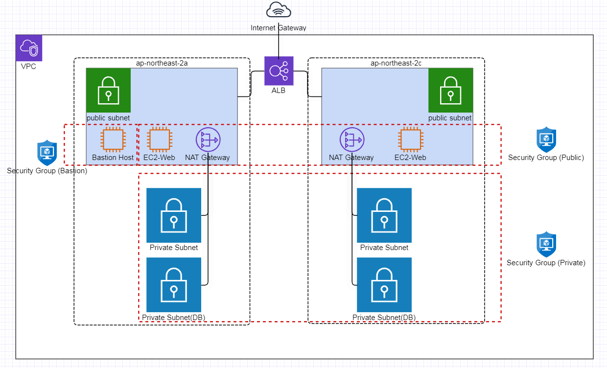

# Repository: devops_demo

The goal of this repo is to implement a 3-tier architecture with load balancing.

## Infrastructure Diagram



## Outputs 

* A VPC with a /16 ip address range
* An internet gateway
* 2 public subnets for web instances
* 2 private subnets for WAS instances 
* 2 private db subnets for DBs
* Security groups for private / public subnets 
* An ALB for load balancing web service
* A bastion ec2 instance on public subnet (with its own security group)

## Requirements 

Some Variables in [variables.tf](./variables.tf) must be specified before apply: 
* "key_pair"
* "bastion_key_pair"
* "bastion_cidr_blocks"

## Creating 

```bash
terraform init
```

```bash
terraform plan
```

```bash
terraform apply
```